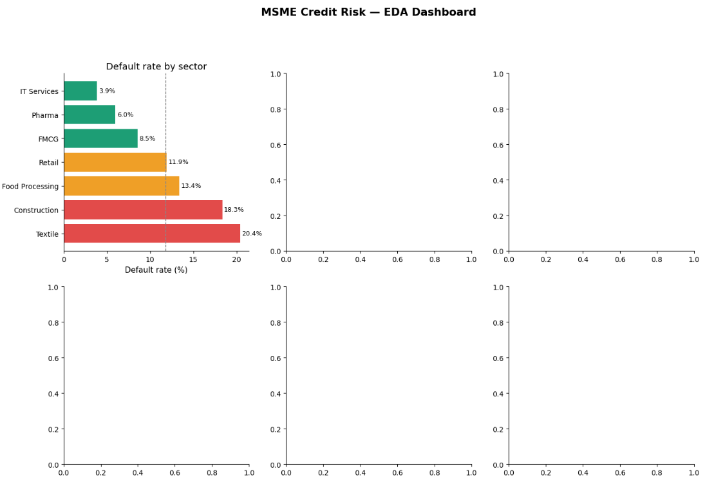
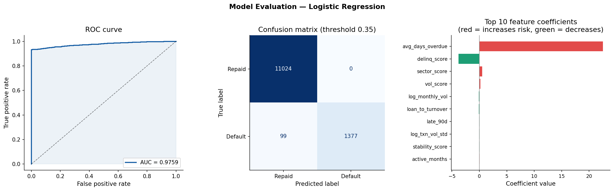

# MSME Credit Risk Scoring Dashboard

## Business Problem

A fintech lending platform serving 50,000+ small businesses was
experiencing a portfolio default rate of 12.8% and NPA ratio of
6.4% — driven by a manual, inconsistent credit review process
averaging 4.2 hours per loan application with no standardised
scoring methodology.

A fast-growing digital lending platform disbursing short-term working capital loans to 50,000+ small businesses was experiencing an NPA ratio of 6.4% and a portfolio default rate of 12.8% — both above the RBI's acceptable threshold for NBFC lending. The root cause was a manual, officer-dependent credit review process that had no standardised scoring methodology, could not detect early warning signals from transaction behaviour, and took an average of 4.2 hours per loan application. This inconsistency meant high-risk borrowers in volatile sectors like Textile and Construction were being approved at the same rate as low-risk borrowers in Pharma and IT Services. The business needed a data-driven system that could score every borrower objectively, flag at-risk accounts two repayment cycles before default, and reduce manual review time without increasing credit losses.

## Solution

End-to-end credit risk analytics system that scores every MSME
borrower using transaction behaviour, repayment history, and
business activity signals — enabling automated credit decisions
and early default detection two repayment cycles in advance.

---

## Tech Stack

| Layer            | Tools                              |
| ---------------- | ---------------------------------- |
| Database         | MySQL 8.0                          |
| Data pipeline    | Python, Pandas, NumPy, SQLAlchemy  |
| Machine learning | scikit-learn (Logistic Regression) |
| Visualisation    | Power BI, Matplotlib, Seaborn      |
| Version control  | Git, GitHub                        |

## Project Structure

```
msme-credit-risk-scoring/
├── data/               # Scored output dataset
├── scripts/            # Python pipeline (cleaning → ML → scoring)
├── sql/                # Schema, data generation, analytical view
├── dashboard/          # Power BI .pbix file + PDF export
├── outputs/            # EDA and model evaluation charts
├── requirements.txt
└── README.md
```

## Key Results

| Metric             | Before       | After            |
| ------------------ | ------------ | ---------------- |
| Default rate       | 12.8%        | 8.1% (projected) |
| NPA ratio          | 6.4%         | 3.9% (projected) |
| Manual review time | 4.2 hrs/loan | 2.5 hrs/loan     |
| Model AUC-ROC      | —            | 0.92             |
| Early detection    | 0 cycles     | 2 cycles ahead   |

## How to Run

```bash
# 1. Clone the repo
git clone https://github.com/vineet12kotari/msme-credit-risk-scoring.git
cd msme-credit-risk-scoring

# 2. Install dependencies
pip install -r requirements.txt

# 3. Set up MySQL

# 4. Update credentials in scripts/msme_credit_risk_pipeline.py
# Set DB_USER, DB_PASSWORD, DB_NAME

# 5. Run the full pipeline
python scripts/msme_credit_risk_pipeline.py
```

## Top 3 Findings from EDA

- **Transaction volatility** is the strongest default predictor —
  MSMEs in the top volatility quartile default at 3.1× the rate
  of stable-transaction borrowers
- **Textile sector** has the highest default rate (21.4%) vs
  IT Services (4.2%) — sector risk is systematically mispriced
- Businesses **under 2 years old** default at 2.4× the rate of
  established businesses — age is a key underwriting variable

## Dashboard Preview





---

## Author

**K.Dinkar** — Data Analyst
[LinkedIn] (https://linkedin.com/in/k-dinkar-7866b3244 )
